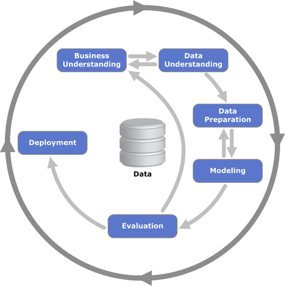

# Detecção de Fraudes Utilizando Regressão Logística

Este projeto utiliza um modelo de machine learning para detectar fraudes transações em cartões de crédito.  
Este repositório contém todo o código necessário, instruções de configuração para o treinamento, uso e avaliação do modelo.

**Autor:** Alexsandro Gehlen  
**Cargo:** Engenheiro de Machine Learning

## 1- Desafio teórico
Está na pasta dentro da raiz questoes-teoricas, neme contém um arquivo md com as respostas das questões \
e do projeto com título desafio-teorico.md e no arquivo questao_1_SQL2PANDAS.ipynb a conversão de SQL para python/pandas.

## 2- Desafio prático
Todo projeto foi desenvolvido em ambiente linux.

### 2.1- Análise exploratória e Modelagem:
Dentro da pasta   contém a análise exploratória e modelagem do desafio, tanto com os ypnb(feito no JUPYTER NOTEBOOK), PDF e html(abrir no browser) para leitura e as explicações.\
Na modelagem utilizo a metodologia CRISP-DM(Processo Padrão Inter-Indústrias para Mineração de Dados), que é interessante
pois é o trânsito entre as etapas, na qual vai avançando e retrocedendo conforme os resultados e teste de mais possibilidades.\
\
Fonte: Wikipédia

### 2.2- Inferência:
Para inferência do modelo foi desenvolvida uma api para acomodar o modelo e que e para classificação da transação ela deve ser enviada via json no formato que será específicado.
A api pode ser executada de duas maneiras como venv ou container. O único pré-requisisto é ter python 3.10.

### 2.2.3 Executar com container
No projeto há um arquivo chamado makefile com execuções definidas. Todas executadas no terminal.

1- Para executar como container necessário realizar o comando no terminal:
    
    make container
			
Na primeira vez que ser executado o comando make container pode ter um tempo de construção de uns 20 minutos, após isso ele apenas executará.
No terminal será impresso o endereço ip do container que você utilizará.
			
3- Json de entrada:
Para a inferência foi optado por enviar o caminho da imagem "simulando" o acesso a um banco de dados.
Na raíz do projeto tem uma pasta chamada colocar-as-imagens-aqui que "simula" o banco de dados, nela já contém duas imagens que usei para testar, para testar outras imagens é só coloca-lás ali.			
Ao executar o passo anterior no terminal irá mostrar o endereço ip, com isso é possível acessar a rota do serviço.
Utilizei o Insomnia para realizar as requisições.  
			
4-	Exemplo Json de entrada:
	
    Método GET
			
Endereço IP(trocar pelo ip printado ao executar make run):

    http://172.18.0.2:5000
				
Endereço IP + rota:

	http://172.18.0.2:5000/inteligencia-artificial/deteccao-fraude
				
Corpo Json de Entrada(este é um exemplo de uma requisição retirada do dataset, está em estrutura de lista para que possa ser mandada mais que uma requisição): \
O primeiro campo é id_transacao que é para garantir o resultado da classificação a sua requisição.
        

    [
        {
            "id_transacao": 456,
            "amt": 3.933589,
            "category_entertainment": 0,
            "category_gas_transport": 0,
            "category_grocery_pos": 0,
            "category_home": 0,
            "category_kids_pets": 0,
            "category_misc_net": 0,
            "category_shopping_net": 0,
            "category_shopping_pos": 0,
            "category_travel": 0,
            "transaction_month_1": 1,
            "transaction_month_2": 0,
            "transaction_month_3": 0,
            "transaction_month_4": 0,
            "transaction_month_5": 0,
            "transaction_month_6": 0,
            "transaction_month_7": 0,
            "transaction_month_8": 0,
            "transaction_month_9": 0,
            "transaction_month_10": 0,
            "transaction_month_11": 0,
            "transaction_month_12": 0,
            "transaction_period_Madrugada": 1,
            "transaction_period_Manhã": 0,
            "transaction_period_Noite": 0,
            "transaction_period_Tarde": 0
        }   
    ]

					
5-	Retorno Json:	

    [
        {
            "fraude": "0",
            "id_transacao": 456,
            "probabilidade": 0.1497196196692277,
            "servico": "Fraude"
        }
    ]

### 2.2.4 Executar como venv:
No projeto há um arquivo chamado makefile com execuções definidas. Todas executadas no terminal.
			
1- Criar venv:

    make venv

2- Ativar venv

    source .venv/bin/activate

3- Definir interpretador python 3.10
		
4- Instalar requirements
    
    make init
			
5- Executar o projeto estand dentro de Alexsadro_Gehlen

    make run
			
6- Json de entrada:
Para a inferência foi optado por enviar o caminho da imagem "simulando" o acesso a um banco de dados.
Ao executar o passo anterior no terminal irá mostrar o endereço ip, com isso é possível acessar a rota do serviço.
Utilizei o Insomnia para realizar as requisições.  
Exemplo Json de entrada:
    
    Método GET

			
Endereço IP(trocar pelo ip printado ao executar make run):

    http://172.18.0.2:5000
				
Endereço IP + rota:

	http://172.18.0.2:5000/inteligencia-artificial/deteccao-fraude
				
Corpo Json de Entrada(este é um exemplo de uma requisição retirada do dataset, está em estrutura de lista para que possa ser mandada mais que uma requisição): \
O primeiro campo é id_transacao que é para garantir o resultado da classificação a sua requisição.
        

    [
        {
            "id_transacao": 456,
            "amt": 3.933589,
            "category_entertainment": 0,
            "category_gas_transport": 0,
            "category_grocery_pos": 0,
            "category_home": 0,
            "category_kids_pets": 0,
            "category_misc_net": 0,
            "category_shopping_net": 0,
            "category_shopping_pos": 0,
            "category_travel": 0,
            "transaction_month_1": 1,
            "transaction_month_2": 0,
            "transaction_month_3": 0,
            "transaction_month_4": 0,
            "transaction_month_5": 0,
            "transaction_month_6": 0,
            "transaction_month_7": 0,
            "transaction_month_8": 0,
            "transaction_month_9": 0,
            "transaction_month_10": 0,
            "transaction_month_11": 0,
            "transaction_month_12": 0,
            "transaction_period_Madrugada": 1,
            "transaction_period_Manhã": 0,
            "transaction_period_Noite": 0,
            "transaction_period_Tarde": 0
        }   
    ]

					
7-	Retorno Json:	

    [
        {
            "fraude": "0",
            "id_transacao": 456,
            "probabilidade": 0.1497196196692277,
            "servico": "Fraude"
        }
    ]    

\
\
